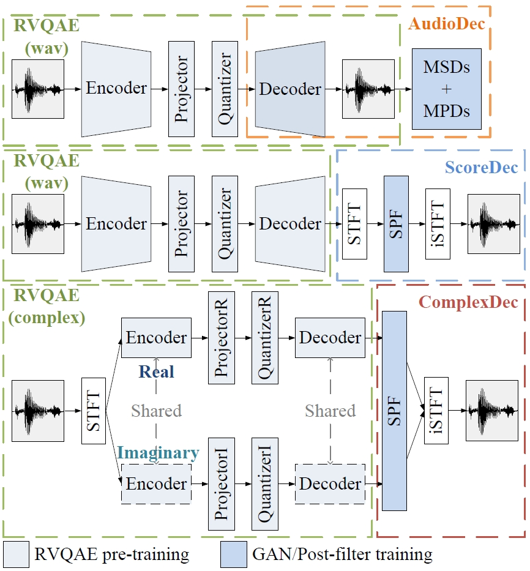
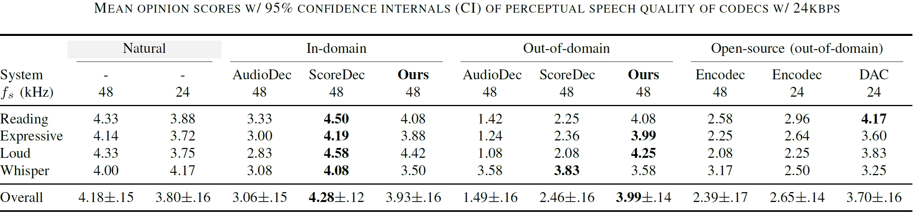
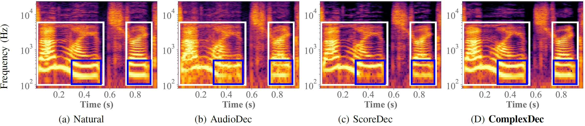

# ComplexDec: A Domain-robust High-fidelity Neural Audio Codec with Complex Spectrum Modeling

<I> Yi-Chiao Wu, Dejan Marković, Steven Krenn, Israel D. Gebru, and Alexander Richard </I>
 

 Meta Reality Labs Research, USA 
   

This page is the demo of ComplexDec [[paper](https://arxiv.org/abs/2502.02019)]

## **Abstract**  

 Neural audio codecs have been widely adopted in audio-generative tasks because their compact and discrete representations are suitable for both large-language-model-style and regression-based generative models. However, most neural codecs struggle to model out-of-domain audio, resulting in error propagations to downstream generative tasks. In this paper, we first argue that information loss from codec compression degrades out-of-domain robustness. Then, we propose full-band 48 kHz ComplexDec with complex spectral input and output to ease the information loss while adopting the same 24 kbps bitrate as the baseline AuidoDec and ScoreDec. Objective and subjective evaluations demonstrate the out-of-domain robustness of ComplexDec trained using only the 30-hour VCTK corpus. 

## **Architecture**  

## **Demo Sounds**
- Out-of-domain test corpus: EARS (*fs*: 48 kHz) 
- All codec bitrates: 24 kbps

| Codec | Amusing | Anger |
|:--|:--:|:--:|
| Natural 48 kHz | <audio src="res/audio/Natural_48/Phase1_LCA832_SEN_amusing_Ref_1.wav" controls preload></audio> | <audio src="res/audio/Natural_48/Phase1_QLX558_SEN_anger_Ref_1.wav" controls preload></audio> |
| Natural 24 kHz | <audio src="res/audio/Natural_24/Phase1_LCA832_SEN_amusing_Ref_1.wav" controls preload></audio> | <audio src="res/audio/Natural_24/Phase1_QLX558_SEN_anger_Ref_1.wav" controls preload></audio> |
| AudioDec (in-domain) | <audio src="res/audio/AudioDec_in/Phase1_LCA832_SEN_amusing_Ref_1.wav" controls preload></audio> | <audio src="res/audio/AudioDec_in/Phase1_QLX558_SEN_anger_Ref_1.wav" controls preload></audio> |
| ScoreDec (in-domain) | <audio src="res/audio/ScoreDec_in/Phase1_LCA832_SEN_amusing_Ref_1.wav" controls preload></audio> | <audio src="res/audio/ScoreDec_in/Phase1_QLX558_SEN_anger_Ref_1.wav" controls preload></audio> |
| ComplexDec (in-domain) | <audio src="res/audio/ComplexDec_in/Phase1_LCA832_SEN_amusing_Ref_1.wav" controls preload></audio> | <audio src="res/audio/ComplexDec_in/Phase1_QLX558_SEN_anger_Ref_1.wav" controls preload></audio> |
| AudioDec (out-of-domain) | <audio src="res/audio/AudioDec_out/Phase1_LCA832_SEN_amusing_Ref_1.wav" controls preload></audio> | <audio src="res/audio/AudioDec_out/Phase1_QLX558_SEN_anger_Ref_1.wav" controls preload></audio> |
| ScoreDec (out-of-domain) | <audio src="res/audio/ScoreDec_out/Phase1_LCA832_SEN_amusing_Ref_1.wav" controls preload></audio> | <audio src="res/audio/ScoreDec_out/Phase1_QLX558_SEN_anger_Ref_1.wav" controls preload></audio> |
| ComplexDec (out-of-domain) | <audio src="res/audio/ComplexDec_out/Phase1_LCA832_SEN_amusing_Ref_1.wav" controls preload></audio> | <audio src="res/audio/ComplexDec_out/Phase1_QLX558_SEN_anger_Ref_1.wav" controls preload></audio> |
| Encodec 48 kHz | <audio src="res/audio/Encodec_48/Phase1_LCA832_SEN_amusing_Ref_1.wav" controls preload></audio> | <audio src="res/audio/Encodec_48/Phase1_QLX558_SEN_anger_Ref_1.wav" controls preload></audio> |
| Encodec 24 kHz | <audio src="res/audio/Encodec_24/Phase1_LCA832_SEN_amusing_Ref_1.wav" controls preload></audio> | <audio src="res/audio/Encodec_24/Phase1_QLX558_SEN_anger_Ref_1.wav" controls preload></audio> |
| DAC 24 kHz | <audio src="res/audio/DAC_24/Phase1_LCA832_SEN_amusing_Ref_1.wav" controls preload></audio> | <audio src="res/audio/DAC_24/Phase1_QLX558_SEN_anger_Ref_1.wav" controls preload></audio> |

| Codec | Reading | Loud |
|:--|:--:|:--:|
| Natural 48 kHz | <audio src="res/audio/Natural_48/Phase1_LCA832_SEN_rainbow_pt1_regular_Ref_1.wav" controls preload></audio> | <audio src="res/audio/Natural_48/Phase1_LCA832_SEN_rainbow_pt1_loud_Ref_1.wav" controls preload></audio> |
| Natural 24 kHz | <audio src="res/audio/Natural_24/Phase1_LCA832_SEN_rainbow_pt1_regular_Ref_1.wav" controls preload></audio> | <audio src="res/audio/Natural_24/Phase1_LCA832_SEN_rainbow_pt1_loud_Ref_1.wav" controls preload></audio> |
| AudioDec (in-domain) | <audio src="res/audio/AudioDec_in/Phase1_LCA832_SEN_rainbow_pt1_regular_Ref_1.wav" controls preload></audio> | <audio src="res/audio/AudioDec_in/Phase1_LCA832_SEN_rainbow_pt1_loud_Ref_1.wav" controls preload></audio> |
| ScoreDec (in-domain) | <audio src="res/audio/ScoreDec_in/Phase1_LCA832_SEN_rainbow_pt1_regular_Ref_1.wav" controls preload></audio> | <audio src="res/audio/ScoreDec_in/Phase1_LCA832_SEN_rainbow_pt1_loud_Ref_1.wav" controls preload></audio> |
| ComplexDec (in-domain) | <audio src="res/audio/ComplexDec_in/Phase1_LCA832_SEN_rainbow_pt1_regular_Ref_1.wav" controls preload></audio> | <audio src="res/audio/ComplexDec_in/Phase1_LCA832_SEN_rainbow_pt1_loud_Ref_1.wav" controls preload></audio> |
| AudioDec (out-of-domain) | <audio src="res/audio/AudioDec_out/Phase1_LCA832_SEN_rainbow_pt1_regular_Ref_1.wav" controls preload></audio> | <audio src="res/audio/AudioDec_out/Phase1_LCA832_SEN_rainbow_pt1_loud_Ref_1.wav" controls preload></audio> |
| ScoreDec (out-of-domain) | <audio src="res/audio/ScoreDec_out/Phase1_LCA832_SEN_rainbow_pt1_regular_Ref_1.wav" controls preload></audio> | <audio src="res/audio/ScoreDec_out/Phase1_LCA832_SEN_rainbow_pt1_loud_Ref_1.wav" controls preload></audio> |
| ComplexDec (out-of-domain) | <audio src="res/audio/ComplexDec_out/Phase1_LCA832_SEN_rainbow_pt1_regular_Ref_1.wav" controls preload></audio> | <audio src="res/audio/ComplexDec_out/Phase1_LCA832_SEN_rainbow_pt1_loud_Ref_1.wav" controls preload></audio> |
| Encodec 48 kHz | <audio src="res/audio/Encodec_48/Phase1_LCA832_SEN_rainbow_pt1_regular_Ref_1.wav" controls preload></audio> | <audio src="res/audio/Encodec_48/Phase1_LCA832_SEN_rainbow_pt1_loud_Ref_1.wav" controls preload></audio> |
| Encodec 24 kHz | <audio src="res/audio/Encodec_24/Phase1_LCA832_SEN_rainbow_pt1_regular_Ref_1.wav" controls preload></audio> | <audio src="res/audio/Encodec_24/Phase1_LCA832_SEN_rainbow_pt1_loud_Ref_1.wav" controls preload></audio> |
| DAC 24 kHz | <audio src="res/audio/DAC_24/Phase1_LCA832_SEN_rainbow_pt1_regular_Ref_1.wav" controls preload></audio> | <audio src="res/audio/DAC_24/Phase1_LCA832_SEN_rainbow_pt1_loud_Ref_1.wav" controls preload></audio> |

| Codec | Reading | Whisper |
|:--|:--:|:--:|
| Natural 48 kHz | <audio src="res/audio/Natural_48/Phase1_QLX558_SEN_rainbow_pt4_regular_Ref_1.wav" controls preload></audio> | <audio src="res/audio/Natural_48/Phase1_QLX558_SEN_rainbow_pt4_whisper_Ref_1.wav" controls preload></audio> |
| Natural 24 kHz | <audio src="res/audio/Natural_24/Phase1_QLX558_SEN_rainbow_pt4_regular_Ref_1.wav" controls preload></audio> | <audio src="res/audio/Natural_24/Phase1_QLX558_SEN_rainbow_pt4_whisper_Ref_1.wav" controls preload></audio> |
| AudioDec (in-domain) | <audio src="res/audio/AudioDec_in/Phase1_QLX558_SEN_rainbow_pt4_regular_Ref_1.wav" controls preload></audio> | <audio src="res/audio/AudioDec_in/Phase1_QLX558_SEN_rainbow_pt4_whisper_Ref_1.wav" controls preload></audio> |
| ScoreDec (in-domain) | <audio src="res/audio/ScoreDec_in/Phase1_QLX558_SEN_rainbow_pt4_regular_Ref_1.wav" controls preload></audio> | <audio src="res/audio/ScoreDec_in/Phase1_QLX558_SEN_rainbow_pt4_whisper_Ref_1.wav" controls preload></audio> |
| ComplexDec (in-domain) | <audio src="res/audio/ComplexDec_in/Phase1_QLX558_SEN_rainbow_pt4_regular_Ref_1.wav" controls preload></audio> | <audio src="res/audio/ComplexDec_in/Phase1_QLX558_SEN_rainbow_pt4_whisper_Ref_1.wav" controls preload></audio> |
| AudioDec (out-of-domain) | <audio src="res/audio/AudioDec_out/Phase1_QLX558_SEN_rainbow_pt4_regular_Ref_1.wav" controls preload></audio> | <audio src="res/audio/AudioDec_out/Phase1_QLX558_SEN_rainbow_pt4_whisper_Ref_1.wav" controls preload></audio> |
| ScoreDec (out-of-domain) | <audio src="res/audio/ScoreDec_out/Phase1_QLX558_SEN_rainbow_pt4_regular_Ref_1.wav" controls preload></audio> | <audio src="res/audio/ScoreDec_out/Phase1_QLX558_SEN_rainbow_pt4_whisper_Ref_1.wav" controls preload></audio> |
| ComplexDec (out-of-domain) | <audio src="res/audio/ComplexDec_out/Phase1_QLX558_SEN_rainbow_pt4_regular_Ref_1.wav" controls preload></audio> | <audio src="res/audio/ComplexDec_out/Phase1_QLX558_SEN_rainbow_pt4_whisper_Ref_1.wav" controls preload></audio> |
| Encodec 48 kHz | <audio src="res/audio/Encodec_48/Phase1_QLX558_SEN_rainbow_pt4_regular_Ref_1.wav" controls preload></audio> | <audio src="res/audio/Encodec_48/Phase1_QLX558_SEN_rainbow_pt4_whisper_Ref_1.wav" controls preload></audio> |
| Encodec 24 kHz | <audio src="res/audio/Encodec_24/Phase1_QLX558_SEN_rainbow_pt4_regular_Ref_1.wav" controls preload></audio> | <audio src="res/audio/Encodec_24/Phase1_QLX558_SEN_rainbow_pt4_whisper_Ref_1.wav" controls preload></audio> |
| DAC 24 kHz | <audio src="res/audio/DAC_24/Phase1_QLX558_SEN_rainbow_pt4_regular_Ref_1.wav" controls preload></audio> | <audio src="res/audio/DAC_24/Phase1_QLX558_SEN_rainbow_pt4_whisper_Ref_1.wav" controls preload></audio> |
  

## **Speech Quality Measurments** 

ComplexDec achieves similar in-domain and out-of-domain coding qualities while AudioDec and ScoreDec suffer significant degradation in coding the out-of-domain speech. ComplexDec also significantly outperforms the open-source Encodec models. The results indicate that the serious information loss cannot be fully compensated by the SPF or by solely increasing the training data. On the other hand, DAC also achieves impressive out-of-domain robustness because of its low compression ratio. However, the marked quality gap between ComplexDec and DAC shows the significant perceptual quality difference between 48 kHz and 24 kHz speech. 

  

  

## **Out-of-domain Magnitude Spectral Comparison** 

We can find that AudioDec fails to reconstruct the harmonic structures and the blur spectrum results in hoarse speech. Although the SPF of ScoreDec can slightly recover the blurry spectrum because of the diffusion nature, the missing harmonics cannot be well recovered. However, ComplexDec well preserves the harmonic structures below 6~kHz because of the less information loss. 

  

##  Liability Disclaimer

The demo page utilizes a public speech dataset (<a href="https://github.com/facebookresearch/ears_dataset">EARS</a>) for demonstration purposes only. The Content of the demo files is provided "as is" and for general informational purposes only. We make no warranties regarding its accuracy or suitability. If you believe that any speech samples infringe upon your rights or violate any laws, please contact us to remove the demo files. We are not liable for any damages arising from the use or reliance on our demo page or open-source code. By accessing the demo page, you agree to release us from any claims or liabilities related to its use. 

  

[Home](https://bigpon.github.io/)

   
 
